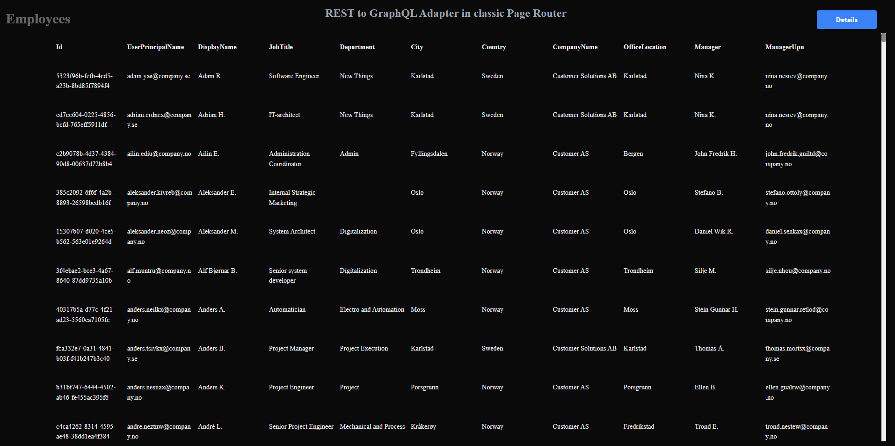
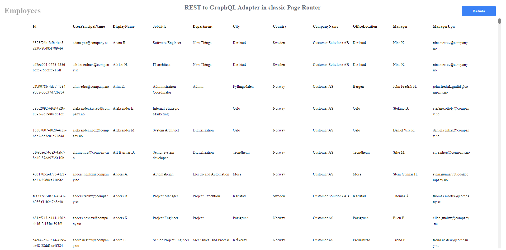
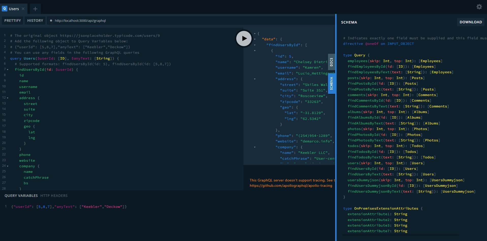
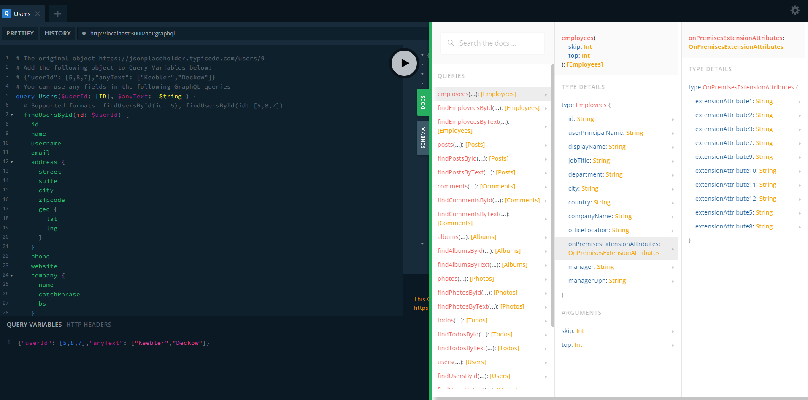
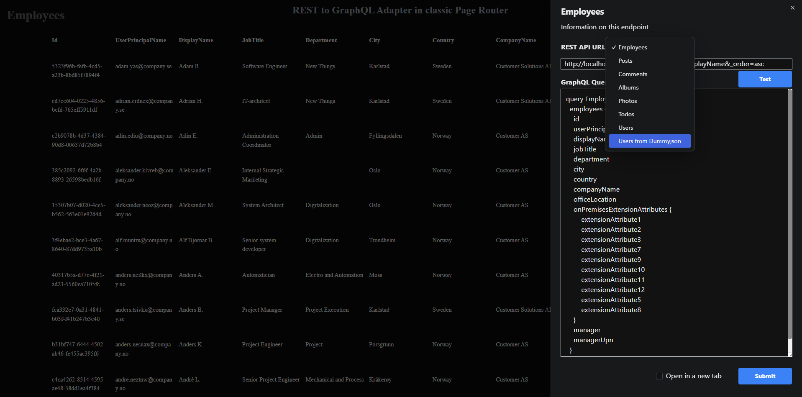
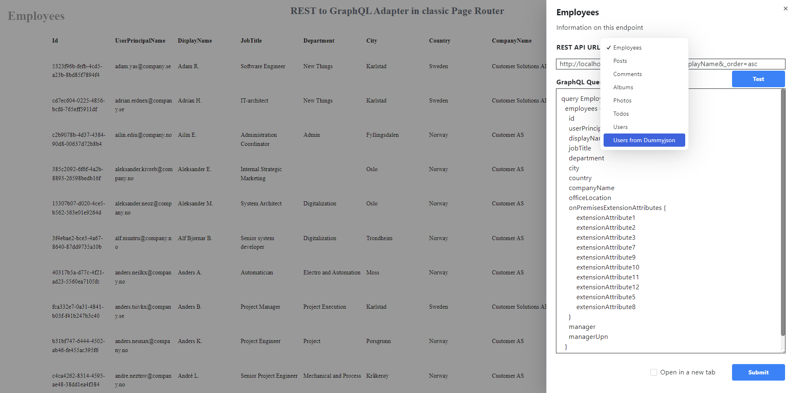
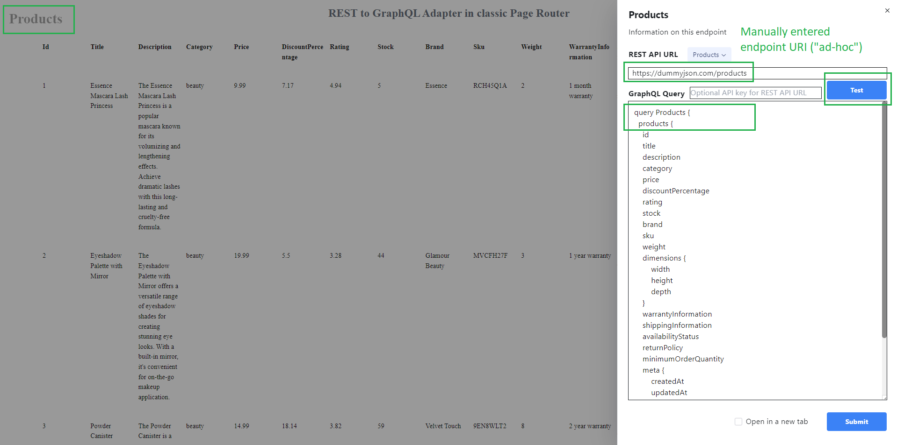
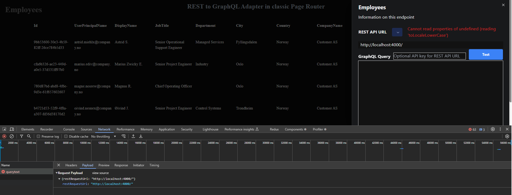

# REST to GraphQL Adapter web app with dynamic plug-and-play data sources and GraphQL Playground for testing queries

Developers have been using REST API for years to work with backend data. However, GraphQL becomes more popular in diverse headless CMS engines because of more convenient data query options.

This adapter web app allows you to transform your existing REST API endpoints to GraphQL entities automatically and expose them for GraphQL queries with filters, selections of fields, dynamic variables and free text search.

# Screenshots

















')

# Overview

- Technical stack: Next.js 15, React 19, TypeScript, GraphQL with Apollo Server and Client, Apollo RestLink, Apollo Integrations for Next.js Page Router setup, public REST API endpoints, Tailwind, Radix UI, local **json-server**, which starts with **concurrently** module and provides a local REST API endpoint (made from a locallly stored JSON file **public/employees.json**).

- I intentionally chose Next.js on Page Router for developing this web application by the reason. The matter is Apollo Server Integrations for Next.js do not have an stable package for App Router. This is the state on Oct 14, 2024.

- After you open the Homepage at http://localhost:3000, the adapter connects to all REST API URLs found in **.env**, retrieves and parses data samples.

- Then it generates GraphQL schema with typeDefs and resolvers for dynamic GraphQL endpoint, which becomes instantly available
  at the URL http://localhost:3000/api/graphql

- After that, Homepage gets and outputs tabular data of the first endpoint using a regular GraphQL query with server **fetch** from the GraphQL API (/api/graphql). The example is shown below.

```javascript
const query = {
  operationName: "Employees",
  variables: {},
  query: `
    query Employees {
      employees {
        id
        userPrincipalName
        displayName
        jobTitle
        department
        city
        country
        companyName
        officeLocation
        onPremisesExtensionAttributes {
            extensionAttribute1
            extensionAttribute2
            extensionAttribute3
            extensionAttribute7
            extensionAttribute9
            extensionAttribute10
            extensionAttribute11
            extensionAttribute12
            extensionAttribute5
            extensionAttribute8
        }
        manager
        managerUpn
      }
    }`,
};
const data = await fetch("http://localhost:3000/api/graphql", {
  method: "POST",
  headers: {
    "content-type": "application/json",
    Authorization: "Bearer <apiKey, for instance from .env>",
  },
  body: JSON.stringify(query),
}).then((r) => r.json());
```

## Options available out of the box in this **Rest to GraphQL adapter** web application

- GraphQL playground with [familiar UI](docs/images/2_graphql-playground-with-dynamic-schema.png).

- Dynamic evaluations of queries and results on the [Homepage](docs/images/1_default-homepage-dark-mode.png). The button **Details** opens the [right-hand panel](docs/images/4_right-hand-panel-with-default-entities-dark-mode.png) with more compact playground UI.

- GraphQL queries for eight preconfigured REST API endpoints are made using the automatically generated GraphQL schema.

- GraphQL queries for other dynamic REST API endpoints not included into default set are made using Apollo RestLink component with a configurable ResponseTransformer, which can be found in the header of [data/restToGraphqlQueryAdapter.ts](data/restToGraphqlQueryAdapter.ts).

```typescript
const responseTransformer = async (response: Response) => {
  const json = await response.json();
  return findArrayOfObjects(json); // Extract the first array
};
```

- The adapter evaluates a few objects from the REST API, generates dynamic schema, and executes GraphQL query to retrieve data.

- The [right-hand panel](docs/images/4_right-hand-panel-with-default-entities-dark-mode.png) has two buttons, **Test** and **Submit**.

  - The button **Test** provides quick evaluations of REST API endpoints. Clicking on the button generates GraphQL schema to the text area, executes GraphQL query and shows results in the main (central) content pane. In case of errors, it shows error messages with details. This option makes it easy to bring and test new endpoints not included in the default set, for instance, https://dummyjson.com/products

  - The button **Submit** generates a stable URL for the currently open query ("permalink") and redirects to this URL.
    The URL can be saved and reused in the same environment, for instance, after restarting the server.
    The logic of redirects uses dynamic routes of Next.js (/url/[[...slug]].tsx) that look like **/url/[encoded REST API URL]/[encoded GraphQL Query]**.

# Typical use cases

Let's put that you have a few REST API endpoints that produce JSON content in standard array-based formats like https://jsonplaceholder.typicode.com/users or https://dummyjson.com/users.

- For instance, array of objects or root object with array of objects or other similar structures. The JSON [format transformer](data/restToGraphqlQueryAdapter.ts) can be adjusted to handle more complicated scenario.

- Initially, you may have a set of complex multi-level JSON objects nested into each other that may look like shown below.

## Source JSON that comes from REST API endpoints

```json
{
    "id": 9,
    "name": "Glenna Reichert",
    "username": "Delphine",
    "email": "Chaim_McDermott@dana.io",
    "address": {
      "street": "Dayna Park",
      "suite": "Suite 449",
      "city": "Bartholomebury",
      "zipcode": "76495-3109",
      "geo": {
        "lat": "24.6463",
        "lng": "-168.8889"
      }
    },
    "phone": "(775)976-6794 x41206",
    "website": "conrad.com",
    "company": {
      "name": "Yost and Sons",
      "catchPhrase": "Switchable contextually-based project",
      "bs": "aggregate real-time technologies"
    }
  },
```

```json
    {
      "id": 9,
      "firstName": "Ethan",
      "lastName": "Martinez",
      "maidenName": "",
      "age": 33,
      "gender": "male",
      "email": "ethan.martinez@x.dummyjson.com",
      "phone": "+92 933-608-5081",
      "username": "ethanm",
      "password": "ethanmpass",
      "birthDate": "1991-2-12",
      "image": "https://dummyjson.com/icon/ethanm/128",
      "bloodGroup": "AB+",
      "height": 159.19,
      "weight": 68.81,
      "eyeColor": "Hazel",
      "hair": {
        "color": "Purple",
        "type": "Curly"
      },
      "ip": "63.191.127.71",
      "address": {
        "address": "466 Pine Street",
        "city": "San Antonio",
        "state": "Louisiana",
        "stateCode": "LA",
        "postalCode": "72360",
        "coordinates": {
          "lat": 74.074918,
          "lng": -25.312703
        },
        "country": "United States"
      },
      "macAddress": "59:e:9e:e3:29:da",
      "university": "Syracuse University",
      "bank": {
        "cardExpire": "02/25",
        "cardNumber": "7183482484317509",
        "cardType": "Visa",
        "currency": "CAD",
        "iban": "CW5U5KS23U7JYD22TVQL7SIH"
      },
      "company": {
        "department": "Support",
        "name": "Gorczany - Gottlieb",
        "title": "Legal Counsel",
        "address": {
          "address": "1597 Oak Street",
          "city": "Chicago",
          "state": "Florida",
          "stateCode": "FL",
          "postalCode": "28100",
          "coordinates": {
            "lat": -67.45208,
            "lng": -23.209886
          },
          "country": "United States"
        }
      },
      "ein": "790-434",
      "ssn": "569-650-348",
      "userAgent": "Mozilla/5.0 (Windows NT 10.0; Win64; x64) AppleWebKit/537.36 (KHTML, like Gecko) Chrome/95.0.4638.69 Safari/537.36",
      "crypto": {
        "coin": "Bitcoin",
        "wallet": "0xb9fc2fe63b2a6c003f1c324c3bfa53259162181a",
        "network": "Ethereum (ERC20)"
      },
      "role": "moderator"
    },
```

## Provided formats of GraphQL queries

The adapter takes a few objects of each endpoint as samples, parses their structures and generates GraphQL schema with type definitions and resolvers that allow you to query any object properties using regular syntax of GraphQL familiar to you.

- You can test your queries in the convenient GraphQL playground available at http://localhost:3000/api/graphql as well as in the right-side panel on the homepage available by clicking on **Details** button on the homepage http://localhost:3000.

- The app provides eight preconfigured dynamic REST API endpoints by default, and you can add more endpoints to .env file.

```bash
  # Default endpoint, which is provided by the locally starting json-server after you execute the command "npm run dev"
  # - The project uses concurrently to start both http://localhost:3000 and http://localhost:4000
  http://localhost:4000/employees?\_sort=displayName&\_order=asc

  https://jsonplaceholder.typicode.com/posts

  https://jsonplaceholder.typicode.com/comments

  https://jsonplaceholder.typicode.com/albums

  https://jsonplaceholder.typicode.com/photos

  https://jsonplaceholder.typicode.com/todos

  https://jsonplaceholder.typicode.com/users

  https://dummyjson.com/users # This endpoint demonstrates name and schema conflict resilutions for two /users endpoints
```

Automatically generated GraphQL queries for two latter endpoints would look as shown below. You can test them in the app playground http://localhost:3000/api/graphql.

```bash
# The original object https://jsonplaceholder.typicode.com/users/9
# Add the following object to Query Variables below:
# {"userId": [5,8,7],"anyText": ["Keebler","Deckow"]}
# You can use any fields in the following GraphQL queries
query Users($userId: [ID], $anyText: [String]) {
  # Supported formats: findUsersById(id: 5), findUsersById(id: [5,8,7])
  findUsersById(id: $userId) {
    id
    name
    username
    email
    address {
      street
      suite
      city
      zipcode
      geo {
        lat
        lng
      }
    }
    phone
    website
    company {
      name
      catchPhrase
      bs
    }
  }

  # Supported formats: findUsersByText(text: "Deck"), findUsersByText(text: ["Keebler","Deckow"])
  findUsersByText(text: $anyText) {
    id
    name
    username
    email
    address {
      street
      suite
      city
      zipcode
      geo {
        lat
        lng
      }
    }
    phone
    website
    company {
      name
      catchPhrase
      bs
    }
  }

  # Supported formats: users(), users(skip: 5), users(skip: 5, top: 3), , users(top: 3)
  users {
    id
    name
    username
    email
    address {
      street
      suite
      city
      zipcode
      geo {
        lat
        lng
      }
    }
    phone
    website
    company {
      name
      catchPhrase
      bs
    }
  }
}
```

```bash
# The original object https://dummyjson.com/users/9
# Add the following object to Query Variables below:
# {"userId": [7,30,21],"anyText": ["Wisconsin","Ethereum","Connecticut"]}
# You can use any fields in the following GraphQL queries
query UsersDummyjson($userId: [ID], $anyText: [String]) {
  # # Supported formats: findUsersById(id: 21), findUsersById(id: [7,30,21])
  findUsersDummyjsonById(id: $userId) {
    id
    firstName
    lastName
    maidenName
    age
    gender
    email
    phone
    username
    password
    birthDate
    image
    bloodGroup
    height
    weight
    eyeColor
    hair {
        color
        type
    }
    ip
    address {
        address
        city
        state
        stateCode
        postalCode
        coordinates {
            lat
            lng
        }
        country
    }
    macAddress
    university
    bank {
        cardExpire
        cardNumber
        cardType
        currency
        iban
    }
    company {
        department
        name
        title
        address {
            address
            city
            state
            stateCode
            postalCode
            coordinates {
                lat
                lng
            }
            country
        }
    }
    ein
    ssn
    userAgent
    crypto {
        coin
        wallet
        network
    }
    role
  }

  # Supported formats: findUsersByText(text: "consin") and findUsersByText(text: ["Wisconsin","Ethereum", "Connecticut"])
  findUsersDummyjsonByText(text: $anyText) {
    id
    firstName
    lastName
    maidenName
    age
    gender
    email
    phone
    username
    password
    birthDate
    image
    bloodGroup
    height
    weight
    eyeColor
    hair {
        color
        type
    }
    ip
    address {
        address
        city
        state
        stateCode
        postalCode
        coordinates {
            lat
            lng
        }
        country
    }
    macAddress
    university
    bank {
        cardExpire
        cardNumber
        cardType
        currency
        iban
    }
    company {
        department
        name
        title
        address {
            address
            city
            state
            stateCode
            postalCode
            coordinates {
                lat
                lng
            }
            country
        }
    }
    ein
    ssn
    userAgent
    crypto {
        coin
        wallet
        network
    }
    role
  }

  # Supported formats: users(), users(skip: 5), users(skip: 5, top: 3), , users(top: 3)
  usersDummyjson {
    id
    firstName
    lastName
    maidenName
    age
    gender
    email
    phone
    username
    password
    birthDate
    image
    bloodGroup
    height
    weight
    eyeColor
    hair {
        color
        type
    }
    ip
    address {
        address
        city
        state
        stateCode
        postalCode
        coordinates {
            lat
            lng
        }
        country
    }
    macAddress
    university
    bank {
        cardExpire
        cardNumber
        cardType
        currency
        iban
    }
    company {
        department
        name
        title
        address {
            address
            city
            state
            stateCode
            postalCode
            coordinates {
                lat
                lng
            }
            country
        }
    }
    ein
    ssn
    userAgent
    crypto {
        coin
        wallet
        network
    }
    role
  }
}
```

# Getting Started

Clone this project.

Review / adjust default settings found in .env.local.

```bash
NEXT_PUBLIC_restEndpoints="
  http://localhost:4000/employees?_sort=displayName&_order=asc
  https://jsonplaceholder.typicode.com/posts
  https://jsonplaceholder.typicode.com/comments
  https://jsonplaceholder.typicode.com/albums
  https://jsonplaceholder.typicode.com/photos
  https://jsonplaceholder.typicode.com/todos
  https://jsonplaceholder.typicode.com/users
  https://dummyjson.com/users"
NEXT_PUBLIC_dataSampleFilter="_start=0&_end=10&$top=10"
apiKeyRest="for instance, an api key for your REST endpoint"
NEXT_PUBLIC_pagetitlehome="REST to GraphQL Adapter"
NEXT_PUBLIC_pagedescriptionhome="Example of Next.js 15 app with GraphQL queries towards REST API endpoint"
NEXT_PUBLIC_pageheader="REST to GraphQL Adapter in classic Page Router"
pagecachetimeout=15 # seconds, for production builds
```

Install modules

```bash
npm i
```

Start the dev server

```bash
npm run dev
```

Open [http://localhost:3000](http://localhost:3000) to load the home page and generate dynamic GraphQL schema.

Open [http://localhost:3000/api/graphql](http://localhost:3000/api/graphql) to load the GraphQL playground and use the generated schema.
