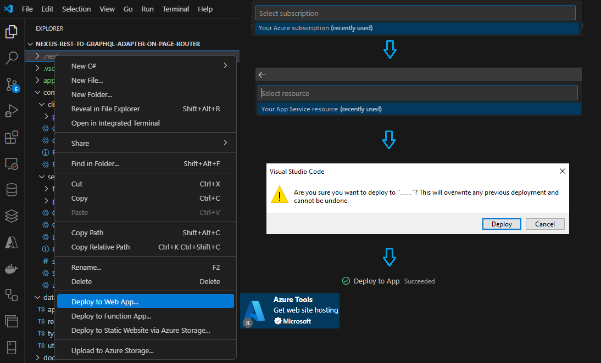
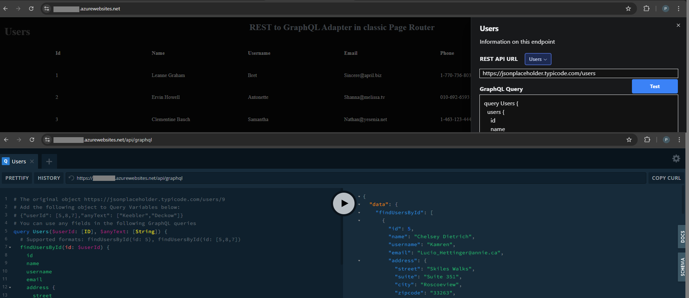

# REST to GraphQL Adapter web app with dynamic plug-and-play data sources and GraphQL Playground for testing queries

Developers have been using REST APIs for years to interact with backend data. However, GraphQL is becoming increasingly popular in various headless CMS engines due to its more flexible and convenient data querying options.

This web app provides automatic transformation of REST API endpoints into GraphQL schema entities, making them available for regular GraphQL queries with filters, field selections, dynamic variables, and free-text search. The app supports preconfigured "plug-and-play" REST API endpoints as well as dynamic REST data sources.

## Version 1.1 (October 23, 2024)

This release supports optional individual API KEYs per each REST API endpoint.

- Optional API keys for pre-registered REST API endpoints should be configured in the .env or .env.local file under
  the SERVER_ONLY_restApiKeys key, as shown below:

  ```bash
  # Optionally, you can add API keys for some of the endpoints above.
  # Keys support regex notation, and their values should be separated by a colon.
  # API keys configured here remain on the server side and are never exposed to the client.
  SERVER_ONLY_restApiKeys="
    employees:ApiKey1
    albums$:ApiKeyForAlbums
    dummyjson.+users$:ApiKeyWithRegexForTheLastEndpoint
  "
  # These REST API endpoints are exposed on both the server and client sides.
  NEXT_PUBLIC_restEndpoints="
    http://localhost:4000/employees?_sort=displayName&_order=asc
    https://jsonplaceholder.typicode.com/posts
    https://jsonplaceholder.typicode.com/comments
    https://jsonplaceholder.typicode.com/albums
    https://jsonplaceholder.typicode.com/photos
    https://jsonplaceholder.typicode.com/todos
    https://jsonplaceholder.typicode.com/users
    https://dummyjson.com/users"
  ```

- API Keys for "ad-hoc" REST API endpoints can be entered directly into the UI of the right-hand panel "Compact playground".

### Additional improvements in Version 1.1.1 (October 23, 2024)

- Upgraded Next.js from v15-beta to the official public release of v15.0.1.

- Fixed [the issue](#deploy-to-azure-app-service) with missing server-side environment variables in standalone production builds.

## Version 1.0

This was the initial release of the main adapter's functionality.

- This version provided a optional generic placeholder to support a single global API KEY shared by all REST endpoints.

# Screenshots


')

# Overview

- Technical stack: Next.js 15, React 19, TypeScript, GraphQL with Apollo Server and Client, Apollo RestLink, Apollo Integrations for Next.js Page Router setup, public REST API endpoints with support for authentication headers, Tailwind, Radix UI, seamless dark/light theme support, mobile device compatibility, and a local **json-server**, which is started using the **concurrently** module and provides optional support for local REST API endpoints (sourced from a locally stored JSON file: **public/employees.json**).

- I intentionally chose Next.js with the Page Router for developing this web application. The reason is that Apollo Server Integrations for Next.js do not yet have a stable package for the App Router. This was the state as of October 14, 2024.

- After you open the Homepage at http://localhost:3000, the adapter connects to all REST API URLs found in **.env**, retrieves and parses data samples.

- Then it generates GraphQL schema with typeDefs and resolvers for dynamic GraphQL endpoint, which becomes instantly available
  at the URL http://localhost:3000/api/graphql

- After that, Homepage gets and outputs tabular data of the first endpoint using a regular GraphQL query with server **fetch** from the GraphQL API (/api/graphql). The example is shown below.

```javascript
const query = {
  operationName: "Employees",
  variables: {},
  query: `
    query Employees {
      employees {
        id
        userPrincipalName
        displayName
        jobTitle
        department
        city
        country
        companyName
        officeLocation
        onPremisesExtensionAttributes {
            extensionAttribute1
            extensionAttribute2
            extensionAttribute3
            extensionAttribute7
            extensionAttribute9
            extensionAttribute10
            extensionAttribute11
            extensionAttribute12
            extensionAttribute5
            extensionAttribute8
        }
        manager
        managerUpn
      }
    }`,
};
const data = await fetch("http://localhost:3000/api/graphql", {
  method: "POST",
  headers: {
    "content-type": "application/json",
    Authorization: "Bearer <apiKey, for instance from .env>",
  },
  body: JSON.stringify(query),
}).then((r) => r.json());
```

## Options available out of the box in this **Rest to GraphQL adapter** web application

- GraphQL playground with [familiar UI](docs/images/2_graphql-playground-with-dynamic-schema.png).

- Dynamic evaluations of queries and results on the [Homepage](docs/images/1_default-homepage-dark-mode.png). The button **Details** opens the [right-hand panel](docs/images/4_right-hand-panel-with-default-entities-dark-mode.png) with more compact playground UI.

- GraphQL queries for eight preconfigured REST API endpoints are made using the automatically generated GraphQL schema.

- GraphQL queries for other dynamic REST API endpoints not included into default set are made using Apollo RestLink component with a configurable ResponseTransformer, which can be found in the header of [data/restToGraphqlQueryAdapter.ts](data/restToGraphqlQueryAdapter.ts).

```typescript
const responseTransformer = async (response: Response) => {
  const json = await response.json();
  return findArrayOfObjects(json); // Extract the first array
};
```

- The adapter evaluates a few objects from the REST API, generates dynamic schema, and executes GraphQL query to retrieve data.

- The [right-hand panel](docs/images/4_right-hand-panel-with-default-entities-dark-mode.png) has two buttons, **Test** and **Submit**.

  - The button **Test** provides quick evaluations of REST API endpoints. Clicking on the button generates GraphQL schema to the text area, executes GraphQL query and shows results in the main (central) content pane. In case of errors, it shows error messages with details. This option makes it easy to bring and test new endpoints not included in the default set, for instance, https://dummyjson.com/products

  - The button **Submit** generates a stable link URL for the currently open query ("permalink") and redirects to this URL.
    The URL can be saved and reused in the same environment, for instance, after restarting the server.
    The logic of redirects uses dynamic routes of Next.js (/url/[[...slug]].tsx) that look like **/url/[encoded REST API URL]/[encoded GraphQL Query]**. Stable links are not generated for "ad-hoc" REST API endpoints in case if a dynamic individual API KEY was entered for it.

# Typical use cases

Imagine you have several REST API endpoints that return JSON content in standard array-based formats,
such as an "array of objects" or "a root object containing an array of objects" or similar structures.

- The JSON format transformer can easily be adapted to handle more complex scenarios.

- For instance, your REST API might initially provide a set of complex, multi-level JSON objects nested within each other.

## Source JSON that comes from REST API endpoints

```json
{
    "id": 9,
    "name": "Glenna Reichert",
    "username": "Delphine",
    "email": "Chaim_McDermott@dana.io",
    "address": {
      "street": "Dayna Park",
      "suite": "Suite 449",
      "city": "Bartholomebury",
      "zipcode": "76495-3109",
      "geo": {
        "lat": "24.6463",
        "lng": "-168.8889"
      }
    },
    "phone": "(775)976-6794 x41206",
    "website": "conrad.com",
    "company": {
      "name": "Yost and Sons",
      "catchPhrase": "Switchable contextually-based project",
      "bs": "aggregate real-time technologies"
    }
  },
```

```json
    {
      "id": 9,
      "firstName": "Ethan",
      "lastName": "Martinez",
      "maidenName": "",
      "age": 33,
      "gender": "male",
      "email": "ethan.martinez@x.dummyjson.com",
      "phone": "+92 933-608-5081",
      "username": "ethanm",
      "password": "ethanmpass",
      "birthDate": "1991-2-12",
      "image": "https://dummyjson.com/icon/ethanm/128",
      "bloodGroup": "AB+",
      "height": 159.19,
      "weight": 68.81,
      "eyeColor": "Hazel",
      "hair": {
        "color": "Purple",
        "type": "Curly"
      },
      "ip": "63.191.127.71",
      "address": {
        "address": "466 Pine Street",
        "city": "San Antonio",
        "state": "Louisiana",
        "stateCode": "LA",
        "postalCode": "72360",
        "coordinates": {
          "lat": 74.074918,
          "lng": -25.312703
        },
        "country": "United States"
      },
      "macAddress": "59:e:9e:e3:29:da",
      "university": "Syracuse University",
      "bank": {
        "cardExpire": "02/25",
        "cardNumber": "7183482484317509",
        "cardType": "Visa",
        "currency": "CAD",
        "iban": "CW5U5KS23U7JYD22TVQL7SIH"
      },
      "company": {
        "department": "Support",
        "name": "Gorczany - Gottlieb",
        "title": "Legal Counsel",
        "address": {
          "address": "1597 Oak Street",
          "city": "Chicago",
          "state": "Florida",
          "stateCode": "FL",
          "postalCode": "28100",
          "coordinates": {
            "lat": -67.45208,
            "lng": -23.209886
          },
          "country": "United States"
        }
      },
      "ein": "790-434",
      "ssn": "569-650-348",
      "userAgent": "Mozilla/5.0 (Windows NT 10.0; Win64; x64) AppleWebKit/537.36 (KHTML, like Gecko) Chrome/95.0.4638.69 Safari/537.36",
      "crypto": {
        "coin": "Bitcoin",
        "wallet": "0xb9fc2fe63b2a6c003f1c324c3bfa53259162181a",
        "network": "Ethereum (ERC20)"
      },
      "role": "moderator"
    },
```

## Provided formats of GraphQL queries

The adapter is designed to handle this complexity. It takes a few sample objects from each endpoint, parses their structures, and generates a GraphQL schema with type definitions and resolvers. This enables you to query any object properties using the standard GraphQL syntax you are already familiar with. You can test your queries in the convenient GraphQL playground provided by the app at http://localhost:3000/api/graphql as well as in the right-side panel on the homepage, accessible by clicking the **Details** button at http://localhost:3000.

- The app provides eight preconfigured dynamic REST API endpoints by default, and you can replace them and add other endpoints by updating the .env file.

```bash
  # Default endpoint, which is provided by the locally starting json-server after you execute the command "npm run dev"
  # - The project uses concurrently to start both http://localhost:3000 and http://localhost:4000
  http://localhost:4000/employees?_sort=displayName&_order=asc

  https://jsonplaceholder.typicode.com/posts

  https://jsonplaceholder.typicode.com/comments

  https://jsonplaceholder.typicode.com/albums

  https://jsonplaceholder.typicode.com/photos

  https://jsonplaceholder.typicode.com/todos

  https://jsonplaceholder.typicode.com/users

  https://dummyjson.com/users # This endpoint demonstrates name and schema conflict resilutions for two /users endpoints
```

Automatically generated GraphQL queries for the two latter endpoints are shown below. You can test them in the app’s playground at http://localhost:3000/api/graphql.

```bash
# The original object https://jsonplaceholder.typicode.com/users/9
# Add the following object to Query Variables below:
# {"userId": [5,8,7],"anyText": ["Keebler","Deckow"]}
# You can use any fields in the following GraphQL queries
query Users($userId: [ID], $anyText: [String]) {
  # Supported formats: findUsersById(id: 5), findUsersById(id: [5,8,7])
  findUsersById(id: $userId) {
    id
    name
    username
    email
    address {
      street
      suite
      city
      zipcode
      geo {
        lat
        lng
      }
    }
    phone
    website
    company {
      name
      catchPhrase
      bs
    }
  }

  # Supported formats: findUsersByText(text: "Deck"), findUsersByText(text: ["Keebler","Deckow"])
  findUsersByText(text: $anyText) {
    id
    name
    username
    email
    address {
      street
      suite
      city
      zipcode
      geo {
        lat
        lng
      }
    }
    phone
    website
    company {
      name
      catchPhrase
      bs
    }
  }

  # Supported formats: users(), users(skip: 5), users(skip: 5, top: 3), , users(top: 3)
  users {
    id
    name
    username
    email
    address {
      street
      suite
      city
      zipcode
      geo {
        lat
        lng
      }
    }
    phone
    website
    company {
      name
      catchPhrase
      bs
    }
  }
}
# Variables: {"userId": [5,8,7],"anyText": ["Keebler","Deckow"]}
```

```bash
# The original object https://dummyjson.com/users/9
# Add the following object to Query Variables below:
# {"userId": [7,30,21],"anyText": ["Wisconsin","Ethereum","Connecticut"]}
# You can use any fields in the following GraphQL queries
query UsersDummyjson($userId: [ID], $anyText: [String]) {
  # # Supported formats: findUsersById(id: 21), findUsersById(id: [7,30,21])
  findUsersDummyjsonById(id: $userId) {
    id
    firstName
    lastName
    maidenName
    age
    gender
    email
    phone
    username
    password
    birthDate
    image
    bloodGroup
    height
    weight
    eyeColor
    hair {
        color
        type
    }
    ip
    address {
        address
        city
        state
        stateCode
        postalCode
        coordinates {
            lat
            lng
        }
        country
    }
    macAddress
    university
    bank {
        cardExpire
        cardNumber
        cardType
        currency
        iban
    }
    company {
        department
        name
        title
        address {
            address
            city
            state
            stateCode
            postalCode
            coordinates {
                lat
                lng
            }
            country
        }
    }
    ein
    ssn
    userAgent
    crypto {
        coin
        wallet
        network
    }
    role
  }

  # Supported formats: findUsersByText(text: "consin") and findUsersByText(text: ["Wisconsin","Ethereum", "Connecticut"])
  findUsersDummyjsonByText(text: $anyText) {
    id
    firstName
    lastName
    maidenName
    age
    gender
    email
    phone
    username
    password
    birthDate
    image
    bloodGroup
    height
    weight
    eyeColor
    hair {
        color
        type
    }
    ip
    address {
        address
        city
        state
        stateCode
        postalCode
        coordinates {
            lat
            lng
        }
        country
    }
    macAddress
    university
    bank {
        cardExpire
        cardNumber
        cardType
        currency
        iban
    }
    company {
        department
        name
        title
        address {
            address
            city
            state
            stateCode
            postalCode
            coordinates {
                lat
                lng
            }
            country
        }
    }
    ein
    ssn
    userAgent
    crypto {
        coin
        wallet
        network
    }
    role
  }

  # Supported formats: users(), users(skip: 5), users(skip: 5, top: 3), , users(top: 3)
  usersDummyjson {
    id
    firstName
    lastName
    maidenName
    age
    gender
    email
    phone
    username
    password
    birthDate
    image
    bloodGroup
    height
    weight
    eyeColor
    hair {
        color
        type
    }
    ip
    address {
        address
        city
        state
        stateCode
        postalCode
        coordinates {
            lat
            lng
        }
        country
    }
    macAddress
    university
    bank {
        cardExpire
        cardNumber
        cardType
        currency
        iban
    }
    company {
        department
        name
        title
        address {
            address
            city
            state
            stateCode
            postalCode
            coordinates {
                lat
                lng
            }
            country
        }
    }
    ein
    ssn
    userAgent
    crypto {
        coin
        wallet
        network
    }
    role
  }
}
# Variables: {"userId": [7,30,21],"anyText": ["Wisconsin","Ethereum","Connecticut"]}
```

# Getting Started

Clone this project.

Review / adjust default settings found in .env.local.

```bash
NEXT_PUBLIC_restEndpoints="
  http://localhost:4000/employees?_sort=displayName&_order=asc
  https://jsonplaceholder.typicode.com/posts
  https://jsonplaceholder.typicode.com/comments
  https://jsonplaceholder.typicode.com/albums
  https://jsonplaceholder.typicode.com/photos
  https://jsonplaceholder.typicode.com/todos
  https://jsonplaceholder.typicode.com/users
  https://dummyjson.com/users"
# Optionally, you can add API keys for some of the endpoints above.
# Keys support regex notation. Their values should be separated with a colon.
SERVER_ONLY_restApiKeys="
  employees:ApiKey1
  albums$:ApiKeyForAlbums
  dummyjson.+users$:ApiKeyWithRegexForTheLastEndpoint
"
NEXT_PUBLIC_dataSampleFilter="_start=0&_end=10&$top=10"
NEXT_PUBLIC_pagetitlehome="REST to GraphQL Adapter"
NEXT_PUBLIC_pagedescriptionhome="Example of Next.js 15 app with GraphQL queries towards REST API endpoint"
NEXT_PUBLIC_pageheader="REST to GraphQL Adapter in classic Page Router"
pagecachetimeout=15 # seconds, for production builds
```

Install modules

```bash
npm i
```

Start the dev servers

- There are two servers managed by the **concurrently** package, running on ports 3000 and 4000 by default.

```bash
npm run all
# Alternatively, use default "npm run dev" to start only the main dev server without starting a local json-server.
# In this case, remove or comment out the entry http://localhost:4000/employees?_sort=displayName&_order=asc in .env.local
# - You can use # or // to comment it out like #http://localhost:4000/employees?_sort=displayName&_order=asc
```

Open http://localhost:3000 to load the homepage and generate the dynamic GraphQL schema.

Open http://localhost:3000/api/graphql to access the GraphQL playground and use the generated schema.

# Deploy to Azure App Service

You can deploy this web app to **Azure App Service**.

- Remove or comment out the line [http://localhost:4000/employees?\_sort=displayName&\_order=asc](http://localhost:4000/employees?_sort=displayName&_order=asc) in .env.local (using # or //)

- Uncomment the line **output: "standalone"** in [next.config.mjs](next.config.mjs) > nextConfig

  ```bash
    // next.config.mjs
    // ...
    //output: "standalone", // Use this flag to ensure successful deployments to Azure App Service.
    env: {
      // Next.js has a known issue: during production builds in "standalone" mode, it does not export server-side variables from .env.local.
      // To resolve this, you should use .env or .env.production for standalone builds.
      // Alternatively, you can declare server-side variables from .env.local as exportable ones in next.config.mjs, as shown below.
      SERVER_ONLY_restApiKeys: process.env.SERVER_ONLY_restApiKeys,
      pagecachetimeout: process.env.pagecachetimeout,
    },
  ```

- Build the app using the command npm build-standalone-win (or build-standalone-unix)

- Deploy the entire folder **.next** to Azure App Service.



## Run on Azure App Service

Start the service, and the app should load with the homepage displayed.



# Deploy to Azure Container Apps

Have a look at the example in [deploy-to-azure-container.sh](deploy-to-azure-container.sh) and [Dockerfile](Dockerfile).
- If you are on Windows, use Git Bash or WSL to execute Unix shell scripts.
- Build a local docker image.
  - Dockerfile contains actions to comment out localhost in .env.local and enable standalone output.
- Push the local image to your Azure Container Registry.
- Create an Azure Container App, for instance, using **az containerapp create**.
- Restrict access to your public IP address.

## Running a standalone build locally

The package **concurrently** does not support standalone mode of Next.js.

- If you wish to use json-server for hosting [http://localhost:4000/employees?\_sort=displayName&\_order=asc](http://localhost:4000/employees?_sort=displayName&_order=asc)
  you should start them in a separate terminal:

  - npm run server

- After that, open the second terminal and execute

  - npm run standalone (which is translated to "node --dns-result-order=ipv4first .next/standalone/server.js")

    Note the parameter --dns-result-order=ipv4first, which eliminates standard connectivity errors on the IP6 address ::1.
